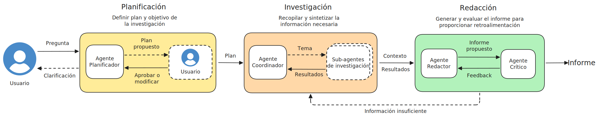
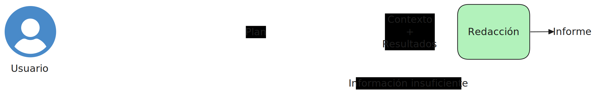

# SPADE Deep Research 

A multi-agent system for automated deep research using SPADE (Smart Python Agent Development Environment). This project implements a coordinator-based architecture where specialized agents collaborate to perform comprehensive literature reviews and generate structured research reports.

## Architecture

### Simplified diagram

